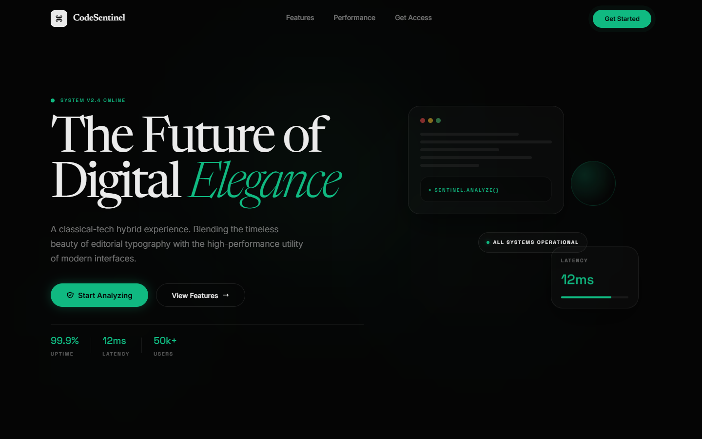
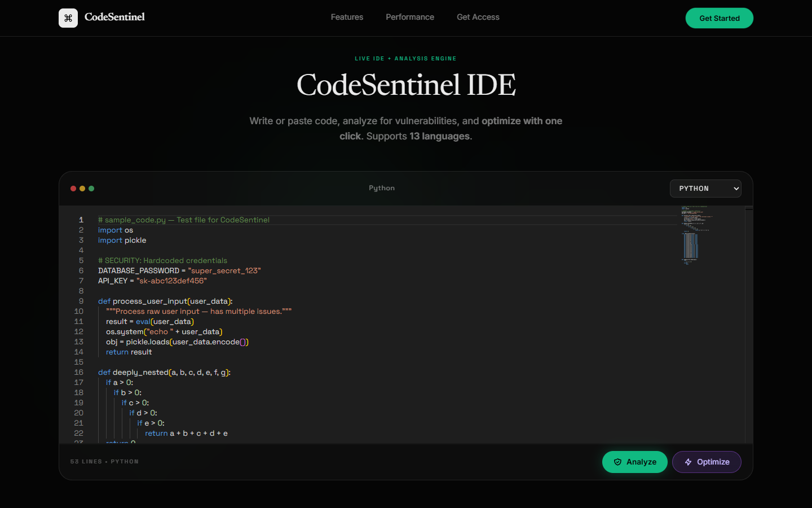
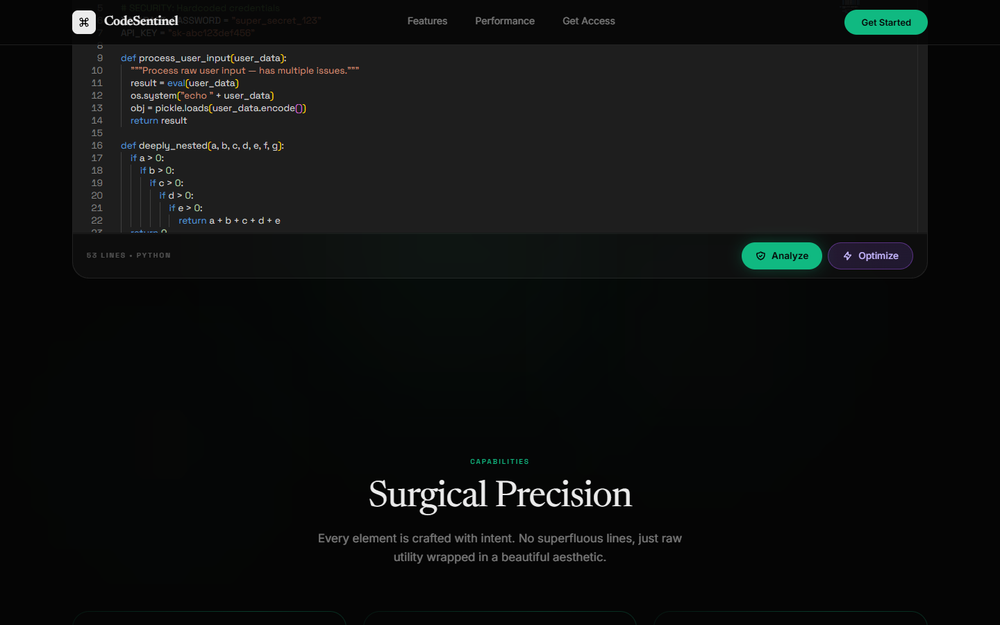

# 🛡️ CodeSentinel — AI-Powered Code Review Agent


[](https://codesentinel-ten.vercel.app/)

> **Fusion: LLM + DevOps + Static Analysis**
> 
> 🚀 **[Live Demo Hosted on Vercel](https://codesentinel-ten.vercel.app/)**

An advanced AI-powered code review agent that leverages multiple LLM backends (OpenAI GPT-4, Anthropic Claude, local models via Ollama) to perform deep code analysis including security vulnerability detection, code quality scoring, architectural review, and automated fix generation.

### 📸 Interface



### 💻 Full Web-Based IDE & AI Optimizer

The built-in web interface features a powerful **Monaco Editor (VS Code engine)** for a first-class coding experience right in your browser. 
- **Analyze Code**: Scans your code for vulnerabilities, bugs, and quality metrics instantly.
- **Optimize Code**: Our AI-driven optimization engine automatically refactors your code for better performance, security, and readability with one click.




### 🌐 Multi-Language Support — 13 Languages Supported

CodeSentinel detects and analyzes vulnerabilities across **Python, JavaScript, TypeScript, Java, C, C++, Go, Rust, Ruby, PHP, C#, Swift, and Kotlin**.

Each language has tailored sample code with intentional issues — security vulnerabilities, quality problems, and architectural anti-patterns — so you can see exactly what CodeSentinel catches.

| Language | Key Detections |
|----------|---------------|
| Python | \`eval()\`, hardcoded secrets, bare \`except\`, deep nesting, God classes |
| JavaScript | \`eval()\`, \`innerHTML\` XSS, \`var\` usage, loose \`==\`, \`console.log\` |
| TypeScript | \`as any\` casts, XSS, empty catches |
| Java | SQL injection, \`Runtime.exec()\`, deserialization, broad \`catch\` |
| C | Buffer overflows (\`gets\`, \`strcpy\`, \`sprintf\`), \`system()\`, format strings |
| C++ | Unsafe casts, manual \`new\`, \`goto\`, buffer overflows |
| Go | \`exec.Command\`, \`panic()\`, no TLS, \`fmt.Print\` in production |
| Rust | \`unsafe\` blocks, \`.unwrap()\`, \`.clone()\`, \`transmute\` |
| Ruby | \`eval\`, \`system\`, \`send\`, \`open\` injection |
| PHP | \`eval\`, \`mysql_query\`, \`md5\`, \`extract\`, \`unserialize\` |
| C# | \`SqlCommand\` injection, \`Process.Start\`, \`BinaryFormatter\` |
| Swift | \`Process\`, \`UnsafePointer\`, \`UnsafeMutablePointer\` |
| Kotlin | SQL injection, \`Runtime.exec()\`, empty catches |

---

## 🏗️ Architecture

```
┌──────────────────────────────────────────────────┐
│                   CodeSentinel                    │
├──────────────────────────────────────────────────┤
│  CLI / GitHub Actions / GitLab CI Integration    │
├──────────┬───────────┬───────────┬───────────────┤
│  AST     │  Security │  Quality  │  Architecture │
│  Analyzer│  Scanner  │  Scorer   │  Reviewer     │
├──────────┴───────────┴───────────┴───────────────┤
│              LLM Orchestration Layer             │
│  ┌─────────┐  ┌──────────┐  ┌─────────────────┐ │
│  │ OpenAI  │  │ Anthropic│  │ Ollama (Local)  │ │
│  └─────────┘  └──────────┘  └─────────────────┘ │
├──────────────────────────────────────────────────┤
│  Diff Parser │ Git Integration │ Report Engine  │
└──────────────────────────────────────────────────┘
```

## ✨ Features

- **Multi-Language Support** — 13 languages: Python, JS, TS, Java, C, C++, Go, Rust, Ruby, PHP, C#, Swift, Kotlin
- **Multi-Model LLM Support** — GPT-4o, Claude 3.5, Llama 3 via Ollama
- **AST-Based Analysis** — Deep understanding of code structure using Python AST, Tree-sitter
- **Security Scanning** — OWASP Top 10, CWE detection, dependency vulnerability checks
- **Code Quality Scoring** — Cyclomatic complexity, maintainability index, technical debt estimation
- **Auto-Fix Generation** — LLM generates fixes with explanations
- **Git Integration** — Review PRs, commits, or entire repositories
- **CI/CD Plugins** — GitHub Actions & GitLab CI ready
- **Report Generation** — HTML, JSON, Markdown reports with severity rankings

## 🚀 Quick Start

```bash
# Clone
git clone https://github.com/Cenizas036/CodeSentinel.git
cd CodeSentinel

# Install
pip install -r requirements.txt

# Configure
cp config/config.example.yaml config/config.yaml
# Edit config.yaml with your API keys

# Review a file
python -m src.main review --file path/to/code.py

# Review a Git diff
python -m src.main review --diff HEAD~1

# Review entire repo
python -m src.main review --repo . --depth full
```

## 📦 Project Structure

```
CodeSentinel/
├── src/
│   ├── __init__.py
│   ├── main.py              # CLI entry point
│   ├── llm/
│   │   ├── __init__.py
│   │   ├── orchestrator.py   # Multi-model routing
│   │   ├── openai_client.py  # OpenAI integration
│   │   ├── anthropic_client.py
│   │   └── ollama_client.py
│   ├── analyzers/
│   │   ├── __init__.py
│   │   ├── ast_analyzer.py   # AST-based code analysis
│   │   ├── security_scanner.py
│   │   ├── quality_scorer.py
│   │   └── architecture_reviewer.py
│   ├── git/
│   │   ├── __init__.py
│   │   └── diff_parser.py
│   └── reporters/
│       ├── __init__.py
│       └── report_engine.py
├── config/
│   └── config.example.yaml
├── tests/
│   └── test_analyzers.py
├── requirements.txt
├── .gitignore
└── LICENSE
```

## ⚙️ Configuration

```yaml
llm:
  primary: openai
  fallback: anthropic
  models:
    openai: gpt-4o
    anthropic: claude-3-5-sonnet
    ollama: llama3:70b

analysis:
  security: true
  quality: true
  architecture: true
  max_file_size_kb: 500

reporting:
  format: markdown
  include_fixes: true
  severity_threshold: medium
```

## 📄 License

MIT License — see [LICENSE](LICENSE) for details.
